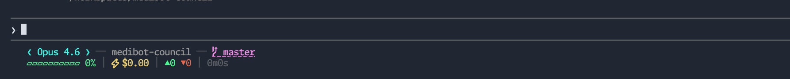

# Claude Code Status Line — SF Console HUD

Claude Code のターミナル下部に表示されるカスタムステータスラインです。セッション情報をリアルタイムで一覧表示します。



## 表示内容

**1行目** — セッション情報
```
❮ Opus ❯ ── my-project ──  main +2 ~3
```
- モデル名
- エージェント名（使用時）
- Vim モード（有効時）
- カレントディレクトリ
- Git ブランチ（リモートがあればクリック可能なリンク付き）
- ステージ済み (`+N`) / 変更済み (`~N`) ファイル数

**2行目** — メトリクス
```
▰▰▰▰▱▱▱▱▱▱ 40% │ ⚡$0.15 │ ▲156 ▼23 │ 3m12s
```
- コンテキストウィンドウ使用率（色分けバー: 緑→黄→赤）
- セッションコスト（USD）
- コード変更行数（追加/削除）
- API 所要時間

## セットアップ

### 1. スクリプトをコピー

```bash
cp statusline.sh ~/.claude/statusline.sh
chmod +x ~/.claude/statusline.sh
```

### 2. 設定に追加

`~/.claude/settings.json` に以下を追加:

```json
{
  "statusLine": {
    "type": "command",
    "command": "bash ~/.claude/statusline.sh"
  }
}
```

次回の Claude Code との対話時にステータスラインが表示されます。

## 依存

- `jq` — JSON パーサー（`brew install jq` / `apt install jq`）
- `git` — ブランチ・差分情報の取得に使用

## フォントについて

ブランチアイコン（``）に Powerline グリフ（`U+E0A0`）を使用しています。このアイコンを正しく表示するには **Nerd Font** が必要です。

```bash
# macOS
brew install --cask font-hack-nerd-font
```

インストール後、ターミナルまたは VS Code のフォント設定を `Hack Nerd Font` 等の Nerd Font に変更してください。

Nerd Font を使わない場合、`statusline.sh` 内の `\ue0a0` を標準 Unicode 文字（例: `⎇`）やテキスト（例: `BR`）に置き換えてください。

## カスタマイズ

`statusline.sh` を編集して表示内容を変更できます。Claude Code から stdin に送られる JSON データの全フィールドについては、公式ドキュメントを参照してください:

https://code.claude.com/docs/en/statusline

## ライセンス

MIT
